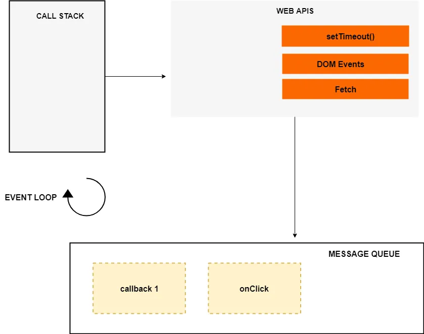
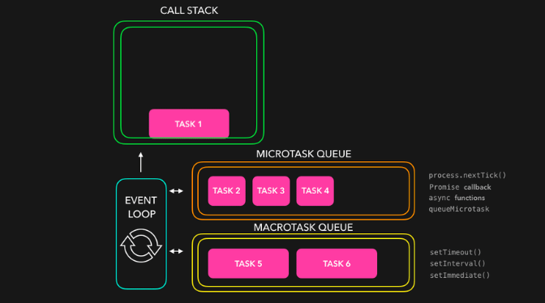

JS使用基于事件循环的单线程执行方式，而且是非抢断执行的（也就是说，无论发生什么，都会把当前任务执行完，不会出现执行到一半就去执行别的任务的情况）。
JS的单线程事件循环很适合前端使用，大幅简化了程序的复杂度，同时前端少会有大型计算任务，所以性能也并非问题。
::: details Asynchronous
JavaScript is a single-threaded programming language which means only one thing can happen at a time. That is, the JavaScript engine can only process one statement at a time in a single thread.

While the single-threaded languages simplify writing code because you don’t have to worry about the concurrency issues, this also means you can’t perform long operations such as network access or image processing without blocking the main thread.

Imagine requesting some data from an API. Depending upon the situation the server might take some time to process the request while blocking the main thread making the web page unresponsive.

That’s where asynchronous JavaScript comes into play. Using asynchronous JavaScript (such as callbacks, promises, and async/await), you can perform long network requests without blocking the main thread.
:::

[Execution Context and Call Stack](../JSBase/executionContext.md)
JavaScript has a single call stack because it’s a single-threaded programming language. The call stack has a LIFO structure which means that the items can be added or removed from the top of the stack only.

## How Does Asynchronous JavaScript Work?
We use asynchronous callbacks to make our code non-blocking.

The event loop, the web APIs and the **callback queue/message queue/task queue** are not part of the JavaScript engine, it’s a part of browser’s JavaScript runtime environment or Nodejs JavaScript runtime environment (in case of Nodejs). In Nodejs, the web APIs are replaced by the C/C++ APIs.



The event loop, the web APIs and the message queue/task queue are not part of the JavaScript engine, it’s a part of browser’s JavaScript runtime environment or Nodejs JavaScript runtime environment (in case of Nodejs). In Nodejs, the web APIs are replaced by the C/C++ APIs.
```js
const networkRequest = () => {
  setTimeout(() => {
    console.log('Async Code');
  }, 2000);
};
console.log('Hello World');
networkRequest();
```
When the above code loads in the browser, the console.log(‘Hello World’) is pushed to the stack and popped off the stack after it’s finished. Next, a call to networkRequest() is encountered, so it’s pushed to the top of the stack.

Next setTimeout() function is called, so it’s pushed to the top of the stack. The setTimeout() has two arguments: 1) callback and 2) time in milliseconds (ms).

The setTimeout() method starts a timer of 2s in the web APIs environment. At this point, the setTimeout() has finished and it’s popped off from the stack. After it, console.log('The End') is pushed to the stack, executed and removed from the stack after its completion.

Meanwhile, the timer has expired, now the callback is pushed to the message queue. But the callback is not immediately executed, and that’s where the event loop kicks in.

### event loop
The job of the Event loop is to look into the call stack and determine if the call stack is empty or not. If the call stack is empty, it looks into the message queue to see if there’s any pending callback waiting to be executed.

1. promise catch try finally 
3. promise.polify
3. 关于promise.then的问题
```js
if(!Promise.allSettled) {
  const rejectHander = (reason) => {
    return {status: 'reject', reason}
  }

  const resolveHander = (value) => {
    return {status: 'resolve', value}
  }

  Promise.allSettled = function(promises) {
    const convertedPromises = promises.map(p => Promise.resolve(p).then(resolveHandler, rejectHandler));

    return Promise.all(convertedPromises);
  }
}
```

#### DOM Events
The Message queue also contains the callbacks from the DOM events such as click events and keyboard events. 
```js
document.querySelector('.btn').addEventListener('click',(event) => {
  console.log('Button Clicked');
});
```
In case of DOM events, the event listener sits in the web APIs environment waiting for a certain event (click event in this case) to happen, and when that event happens, then the callback function is placed in the message queue waiting to be executed.
### ES6 Job Queue/ Micro-Task queue
ES6 introduced the concept of job queue/micro-task queue which is used by Promises in JavaScript. The difference between the message queue and the job queue is that the job queue has a higher priority than the message queue, which means that promise jobs inside the job queue/ micro-task queue will be executed before the callbacks inside the message queue.
```js
console.log('Script start');
setTimeout(() => {
  console.log('setTimeout');
}, 0);
new Promise((resolve, reject) => {
    resolve('Promise 1 resolved');
  }).then(res => console.log(res));
new Promise((resolve, reject) => {
  resolve('Promise 2 resolved');
  }).then(res => {
       console.log(res);
       return new Promise((resolve, reject) => {
         resolve('Promise 3 resolved');
       })
     }).then(res => console.log(res));
console.log('Script End');

// Script start
// Script End
// Promise 1 resolved
// Promise 2 resolved
// Promise 3 resolved
// setTimeout
```

### Micro-task vs Macro-task
- 常见的宏任务有：script（整体代码）/setTimout/setInterval/setImmediate(node 独有)/requestAnimationFrame(浏览器独有)/IO/UI render（浏览器独有）
- 常见的微任务有：process.nextTick(node 独有)/Promise.then()/cath()/finally()/Async/Await(就是Promise)/Object.observe/MutationObserver(html5新特性)/queueMicrotask


**macro-task queue vs task queue**
the macro-task queue works the same as the task queue. The only small difference between the two is that the task queue is used for synchronous statements whereas the macro-task queue is used for asynchronous statements.
It is worth mentioning that the execution of a JavaScript code execution is itself a macro-task. 

**定时器不准时**
setTimeout的回调不一定在指定时间后能执行。而是在指定时间后，将回调函数放入事件循环的队列中。
如果时间到了，JS引擎还在执行同步任务，这个回调函数需要等待；如果当前事件循环的队列里还有其他回调，需要等其他回调执行完。
另外，setTimeout 0ms 也不是立刻执行，它有一个默认最小时间，为4ms。
```js
// 因为取出第一个宏任务之前在执行全局Script，如果这个时间大于 4ms，这时 setTimeout 的回调函数已经放入队列，就先执行 setTimeout；如果准备时间小于 4ms，就会先执行 setImmediate。

// node
setTimeout(() => {
  console.log('setTimeout')
}, 0)
setImmediate(() => {
  console.log('setImmediate')
})
```
```js
async function async1() {
  // 使用await关键字与Promise.then效果类似  await Promise.resolve()
  // 同步1
  await async2() 
  // 相当于Promise.then()里的回调 
  // 微任务1
  console.log('async1 end')
}
async function async2() {
  console.log('async2 end') // 同步2
}
setTimeout(()=>{
  console.log('setTimeout') // 宏任务1
},0)
async1()
new Promise((resolve,reject)=> {
  console.log('promise') // 同步3
  resolve()
}).then(()=>{
  console.log('promise1') // 微任务1
}).then(()=>{
  console.log('promise2') // 微任务2
})
// async2 end
// promise
// async1 end
// promise1
// promise2
// setTimeout
```

```js
<ul id="myLink">
  <li id="1">aaa</li>
  <li id="2">bbb</li>
  <li id="3">ccc</li>
</ul>

let ul = document.querySelector('#myLink')
let liArray =document.querySelectorAll('i')
for(let i=0; i<liArray.length; i++) {
  liArray[i].onclick = function(e){
    target = e.target || e.src
  }
}

transition-property infinity
transition-during
transition-delay
transition-timing-function liner ease-out ease-in ease-in-out
cubic-bezier
```
## Promise
async /əˈsɪŋk/

In JavaScript, promises and async/await are two different ways to handle asynchronous /eɪˈsɪŋkrənəs/  operations. 

Promise
A promise is an object that eventually leads to an asynchronous operation’s completion or failure. A promise can be in one of three states: pending, fulfilled, or rejected. When the asynchronous operation is completed, the Promise will either be fulfilled with a value or rejected with an error.

```js
new Promise((resolve, reject) => {
  
})
```

1.[Understanding Asynchronous JavaScript](https://blog.bitsrc.io/understanding-asynchronous-javascript-the-event-loop-74cd408419ff)
2.[The JavaScript Event Loop: Explained](https://towardsdev.com/event-loop-in-javascript-672c07618dc9)
3.[Understanding Promises in JavaScript](https://blog.bitsrc.io/understanding-promises-in-javascript-c5248de9ff8f)