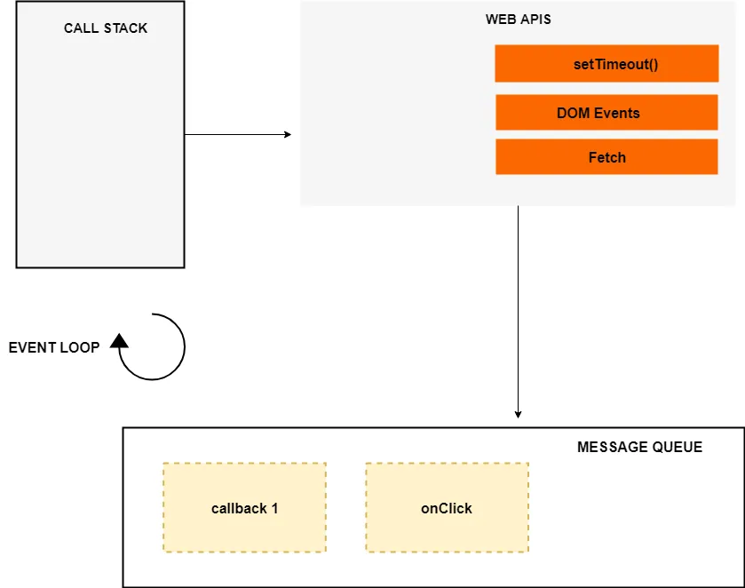

::: details Asynchronous
JavaScript is a single-threaded programming language which means only one thing can happen at a time. That is, the JavaScript engine can only process one statement at a time in a single thread.

While the single-threaded languages simplify writing code because you don’t have to worry about the concurrency issues, this also means you can’t perform long operations such as network access or image processing without blocking the main thread.

Imagine requesting some data from an API. Depending upon the situation the server might take some time to process the request while blocking the main thread making the web page unresponsive.

That’s where asynchronous JavaScript comes into play. Using asynchronous JavaScript (such as callbacks, promises, and async/await), you can perform long network requests without blocking the main thread.
:::

[Execution Context and Call Stack](../JSBase/executionContext.md)
JavaScript has a single call stack because it’s a single-threaded programming language. The call stack has a LIFO structure which means that the items can be added or removed from the top of the stack only.

## How Does Asynchronous JavaScript Work?
We use asynchronous callbacks to make our code non-blocking.

The event loop, the web APIs and the **callback queue/message queue/task queue** are not part of the JavaScript engine, it’s a part of browser’s JavaScript runtime environment or Nodejs JavaScript runtime environment (in case of Nodejs). In Nodejs, the web APIs are replaced by the C/C++ APIs.



The event loop, the web APIs and the message queue/task queue are not part of the JavaScript engine, it’s a part of browser’s JavaScript runtime environment or Nodejs JavaScript runtime environment (in case of Nodejs). In Nodejs, the web APIs are replaced by the C/C++ APIs.
```js
const networkRequest = () => {
  setTimeout(() => {
    console.log('Async Code');
  }, 2000);
};
console.log('Hello World');
networkRequest();
```
When the above code loads in the browser, the console.log(‘Hello World’) is pushed to the stack and popped off the stack after it’s finished. Next, a call to networkRequest() is encountered, so it’s pushed to the top of the stack.

Next setTimeout() function is called, so it’s pushed to the top of the stack. The setTimeout() has two arguments: 1) callback and 2) time in milliseconds (ms).

The setTimeout() method starts a timer of 2s in the web APIs environment. At this point, the setTimeout() has finished and it’s popped off from the stack. After it, console.log('The End') is pushed to the stack, executed and removed from the stack after its completion.

Meanwhile, the timer has expired, now the callback is pushed to the message queue. But the callback is not immediately executed, and that’s where the event loop kicks in.

### event loop
The job of the Event loop is to look into the call stack and determine if the call stack is empty or not. If the call stack is empty, it looks into the message queue to see if there’s any pending callback waiting to be executed.

1. promise catch try finally 
3. promise.polify
3. 关于promise.then的问题
```js
if(!Promise.allSettled) {
  const rejectHander = (reason) => {
    return {status: 'reject', reason}
  }

  const resolveHander = (value) => {
    return {status: 'resolve', value}
  }

  Promise.allSettled = function(promises) {
    const convertedPromises = promises.map(p => Promise.resolve(p).then(resolveHandler, rejectHandler));

    return Promise.all(convertedPromises);
  }
}
```
```js
<ul id="myLink">
  <li id="1">aaa</li>
  <li id="2">bbb</li>
  <li id="3">ccc</li>
</ul>

let ul = document.querySelector('#myLink')
let liArray =document.querySelectorAll('i')
for(let i=0; i<liArray.length; i++) {
  liArray[i].onclick = function(e){
    target = e.target || e.src
  }
}

transition-property infinity
transition-during
transition-delay
transition-timing-function liner ease-out ease-in ease-in-out
cubic-bezier
```

async /əˈsɪŋk/

In JavaScript, promises and async/await are two different ways to handle asynchronous /eɪˈsɪŋkrənəs/  operations. 

Promise
A promise is an object that eventually leads to an asynchronous operation’s completion or failure. A promise can be in one of three states: pending, fulfilled, or rejected. When the asynchronous operation is completed, the Promise will either be fulfilled with a value or rejected with an error.

```js
new Promise((resolve, reject) => {
  
})
```

1.[Understanding Asynchronous JavaScript](https://blog.bitsrc.io/understanding-asynchronous-javascript-the-event-loop-74cd408419ff)