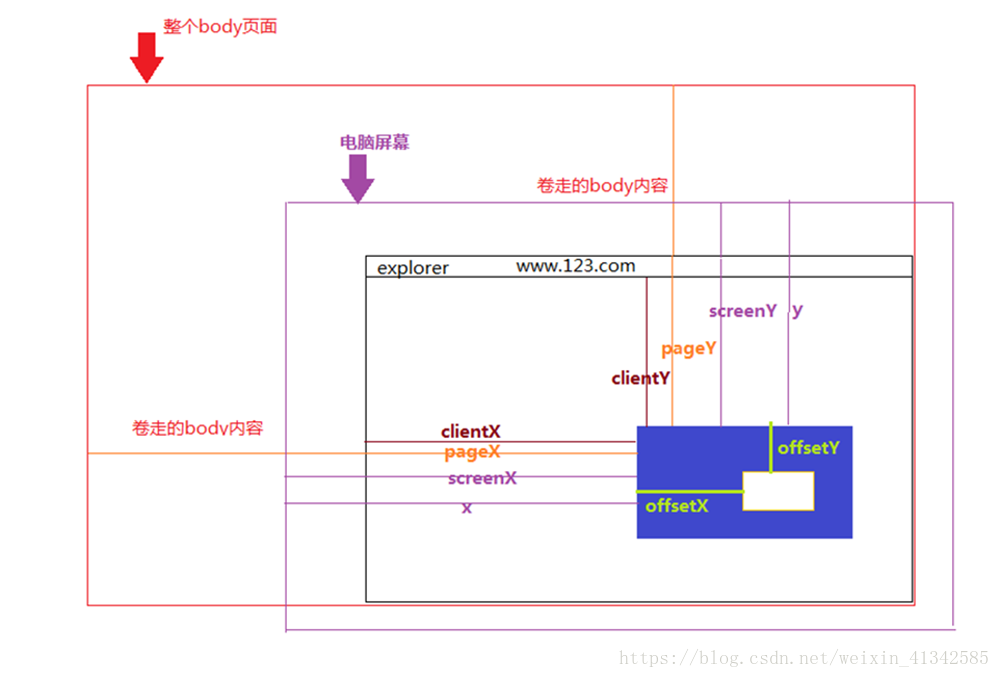

## CSS动画
### Transtion
- transtion-property
- transtion-during: s/ms 
- transtion-delay: 可以为负值，如-1s，及从第1s开始运动
- transtion-timing-function: 
  1. 贝塞尔曲线：liner / ease / ease-in / ease-out / ease-in-out / cubic-bezier(n,n,n,n)
  2. 阶跃函数（Steps）: 
    - steps(9, start): 
      - 9 阶数，表示将过程和时间分为9步。
      - start 表示在动画开始时，我们需要立即开始第一段的动画。
      - end（默认）表示改变不应该在最开始的时候发生，而是发生在每一段的最后时刻。
    - step-start: 等价于steps(1, start)。 使用此计时功能，动画或过渡将突然更改为结束状态并保持在该位置直到动画结束。
    - step-end: 等价于 steps(1, end)。 使用此计时功能，动画或过渡将保持其初始状态直到结束，然后直接跳转到其最终位置。
- transitionend事件: CSS 动画完成后，会触发 transitionend 事件。
  1. event.propertyName ：当前完成动画的属性，这在我们同时为多个属性加上动画时会很有用。
  2. event.elapsedTime ：动画完成的时间（按秒计算），不包括 transition-delay。
```html
<!-- 栗子1 -->
<button id="growing">Click me</button>

<style>
#growing {
  transition: font-size 3s, color 2s;
}
</style>

<script>
growing.onclick = function() {
  this.style.fontSize = '36px';
  this.style.color = 'red';
};
</script>

<!-- 栗子2 -->
<div id="stripe">0123456789</div>
<style>
#stripe {
  display: inline-block
}

#stripe.animate {
  transform: translate(-90%);
  transition-property: transform;
  transition-duration: 9s;
  transition-timing-function: linear;
}
</style>
<script>
stripe.onclick = function() {
  stripe.classList.add('animate');
};
</script>
```
### Keyframes
```html
<style>
  @keyframes loading {
    from {
      opacity: 0;
    }
    to {
      opacity: 0;
    }
  }
  .load {
    animation: loading 1s liner;
  }
</style>
```
## js动画
```js
  window.requestAnimationFrame = (function() {
    return window.requestAnimationFrame ||
      window.webkitRequestAnimationFrame ||
      window.mozRequestAnimationFrame ||
      window.oRequestAnimationFrame ||
      window.msRequestAnimationFrame ||
      function(callback) {
        window.setTimeout(callback, 1000 / 60)
      }
  })()
```

onmousedown
onmouseup
onmousemove
onmouseover: 鼠标经过事件
onmouseout：鼠标划出事件

box.onmousedown = function(e){
    console.log(e)
}

- clientX/clienY 双精度浮点数，点击位置距离当前body可视区域的x，y坐标
- pageX/pageY 基于文档的边缘，考虑页面滚动。举个例子，如果页面向右滚动 200px 并出现了滚动条，这部分在窗口之外，然后鼠标点击距离窗口左边 100px 的位置，pageX 所返回的值将是 300。
- screenX/screenY 点击位置距离当前电脑屏幕的x，y坐标
- offsetX/offsetY 相对于带有定位的父盒子的x，y坐标
- x/y 和screenX、screenY一样 


touch事件中的touches、targetTouches和changedTouches   clientX/clientY screenX/screenY  pageX/pageY
- touches: 当前屏幕上所有触摸点的列表;
- targetTouches: 当前对象上所有触摸点的列表;
- changedTouches: 涉及当前(引发)事件的触摸点的列表

[书籍HTML5+JavaScript动画基础源码](https://github.com/lamberta/html5-animation)
[贝塞尔曲线](https://cubic-bezier.com/#.17,.67,.83,.67)
[张鑫旭翻译的Snap.svg](https://www.zhangxinxu.com/github/demo-Snap.svg/demo/basic/)

