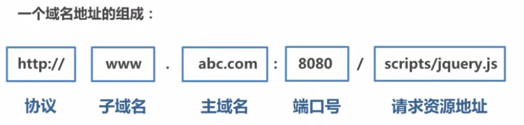
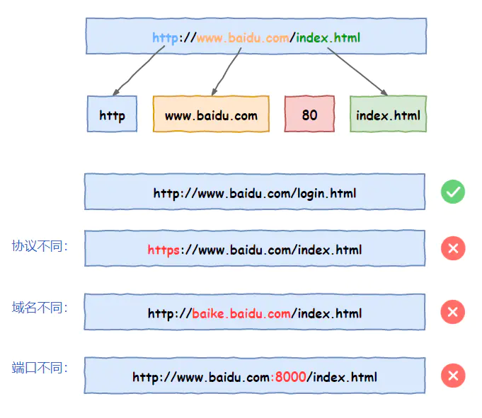

## 同源策略 Same Origin Policy
同源策略是一种约定，它是浏览器最核心也最基本的安全功能，如果缺少了同源策略，浏览器很容易受到XSS、CSRF等攻击。所谓同源是指"协议+域名+端口"三者相同，即便两个不同的域名指向同一个ip地址，也非同源。

域名分级规则：从右至左表示范围的递进，用符号『.』来分割。
如：kyfw.12306.cn 域名中
- 『cn』就叫做顶级域名
- 『12306.cn』是二级域名
- 『kyfw.12306.cn』是三级域名/主机名hostname
[彻底搞懂「同源same-origin」和「同站same-site」的区别](https://juejin.cn/post/6877496781505200142)

当协议、域名、端口号中任意一个不相同时，都算作不同域。不同域之间相互请求资源，就算作“跨域”。

同源策略限制内容有：
- Cookie、LocalStorage、IndexedDB 等存储性内容
- DOM 节点
- AJAX 请求发送后，结果被浏览器拦截了
但是有三个标签是允许跨域加载资源：
- ``
- `<link href=XXX>`
- `<script src=XXX>`

特别说明两点：
第一：如果是协议和端口造成的跨域问题“前台”是无能为力的。
第二：在跨域问题上，仅仅是通过“URL的首部”来识别而不会根据域名对应的IP地址是否相同来判断。“URL的首部”可以理解为“协议, 域名和端口必须匹配”。
这里你或许有个疑问：请求跨域了，那么请求到底发出去没有？
跨域并不是请求发不出去，请求能发出去，服务端能收到请求并正常返回结果，只是结果被浏览器拦截了。你可能会疑问明明通过表单的方式可以发起跨域请求，为什么 Ajax 就不会?因为归根结底，跨域是为了阻止用户读取到另一个域名下的内容，Ajax 可以获取响应，浏览器认为这不安全，所以拦截了响应。但是表单并不会获取新的内容，所以可以发起跨域请求。同时也说明了跨域并不能完全阻止 CSRF，因为请求毕竟是发出去了。

解决方法：
1. CROS
CORS是一个W3C标准，全称是"跨域资源共享"（Cross-origin resource sharing）。
它允许浏览器向跨源服务器，发出XMLHttpRequest请求，从而克服了AJAX只能同源使用的限制。
Access-Control-Allow-Origin
[跨域资源共享 CORS 详解 - 阮一峰](http://www.ruanyifeng.com/blog/2016/04/cors.html)

### 为什么form表单提交没有跨域问题，但ajax提交有跨域问题？
因为原页面用 form 提交到另一个域名之后，原页面的脚本无法获取新页面中的内容。所以浏览器认为这是安全的。而 AJAX 是可以读取响应内容的，因此浏览器不能允许你这样做。如果你细心的话你会发现，其实请求已经发送出去了，你只是拿不到响应而已。所以浏览器这个策略的本质是，一个域名的 JS ，在未经允许的情况下，不得读取另一个域名的内容。但浏览器并不阻止你向另一个域名发送请求。

## canvas 画布污染
图像可能含有一些私有信息（例如验证码，签名，一个裸照，...）， 而一个网页通常含有一些广告之类的信息，这些信息并不是由页面直接控制的， 所以浏览器需要防止这些信息读取私有图片。
直接使用  是没什么问题的，因为图像尽管被浏览器显示， 便签对象并不能获取图像的内部数据。

If you are running locally using file:// this is generally always seen as a cross domain issue; so its better to go via
http://localhost/

“我看你简历上说使用过 canvas ，能说说什么是 canvas 污染么？”
“将一张跨域的图片绘制到 canvas 上，这个 canvas 就是被污染的，此时无法读取该 canvas 的数据。”
“那你能说说浏览器为什么要做这个限制？”
“为了用户的安全。” 由于之前没有思考过，又不想承认不会，我随口一说。
“能具体讲讲么？” 面试官似乎读出了我言语中的犹豫。
“嗯。。。让我想想。” 先稳住，假装不慌，其实内心慌得一p。
“这个是同源策略的限制。应该是为了避免第三方网站读取其他网站的图片数据，避免用户隐私泄露。比如已知某个隐私图片的 url，进入第三方网站后，可以请求到该图片，如果不做数据读取限制的话，该数据将被传送到网站后台进而导致信息泄露。”
“很好。那如果是我们自己的网站要用，有什么解决方案？”
“嗯，这个要看能否控制图片的响应了。如果可以控制的话，利用 cors 跨域，并在图片请求发起时增加 crossOrigin = "Anonymous" 设置；否则只能自己的网站做个代理，让网站与图片同源。”

加了 crossorigin 属性，则表明图片就一定会按照 CORS 来请求图片。而通过CORS 请求到的图片可以再次被复用到 canvas 上进行绘制。换言之，如果不加 crossorigin 属性的话，那么图片是不能再次被复用到 canvas 上去的。
可以设置的值有 anonymous 以及 use-credentials，2 个 value 的作用都是设置通过 CORS 来请求图片，区别在于 use-credentials 是加了证书的 CORS。
如果默认用户不进行任何设置，那么就不会发起 CORS 请求。但如果设置了除 anonymous 和 use-credentials 以外的其他值，包括空字串在内，默认会当作 anonymous来处理。

[10种跨域解决方案（附终极大招）](https://juejin.cn/post/6844904126246027278)
[因为一个跨域请求，我差点丢了饭碗](https://juejin.cn/post/6844904170764369934)
https://juejin.cn/post/6844903767226351623
[解决canvas图片getImageData,toDataURL跨域问题](https://www.zhangxinxu.com/wordpress/2018/02/crossorigin-canvas-getimagedata-cors/)
[WebGL 跨域图像](https://webglfundamentals.org/webgl/lessons/zh_cn/webgl-cors-permission.html)
[一次 H5 「保存页面为图片」 的踩坑之旅](https://juejin.cn/post/6844903513848283143)