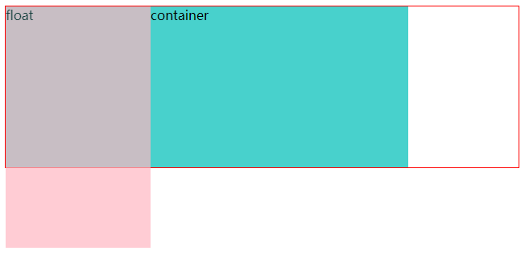
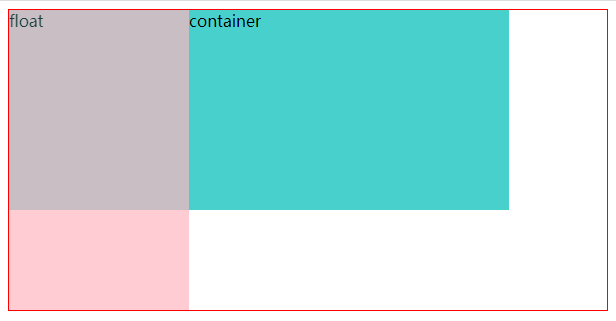
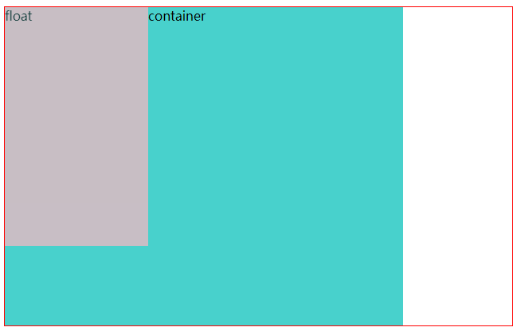
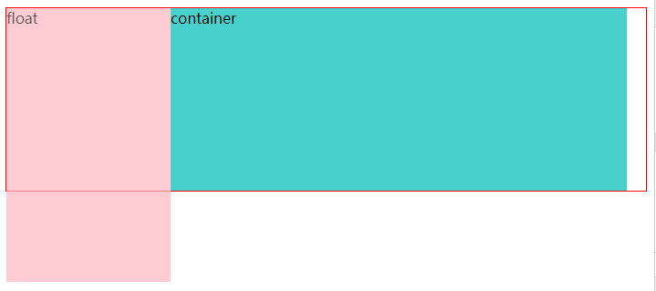

box = margin + border + padding + content。
除了content，其余属性都包括left、right、top和bottom等扩展属性。
padding着色随background-color而变，可用background-clip隔离。
`box-sizing`
- border-box：唯一缺点是，作为CSS3规范的一部分，会有兼容性问题。不过随着新浏览器的发布，这一点变得越来越不重要。
- content-box 
不具备继承性，若全局统一盒模型，那只能使用*声明box-sizing。

### 视觉格式化模型 Visual Formatting Model
是根据 基础盒模型(CSS basic box model) 将 文档(doucment) 中的元素转换一个个盒子的实际算法。
官方说法就是： 它规定了用户端在媒介中如何处理文档树( document tree )。

盒子的生成是 CSS视觉格式化模型 的一部分，用于从文档元素生成盒子(box，CSS布局基本单位)。盒子的类型取决于CSS `display` 属性。
格式化上下文(formatting context) 是定义 盒子环境 的规则，不同 格式化上下文(formatting context) 下的盒子有不同的表现。

FC的全称是：Formatting Contexts，译作格式化上下文，是W3C CSS2.1规范中的一个概念。
它是页面中的一块渲染区域，并且有一套渲染规则，它决定了其子元素将如何定位，以及和其他元素的关系和相互作用。
CSS2.1中只有BFC和IFC，CSS3中才有GFC和FFC。

#### 块级元素
当节点的display声明为`block`、`list-item`、`table`、`flex`或`grid`时，该节点被标记为块级元素。块级元素默认宽度为100%，在垂直方向上按顺序放置，同时参与块格式化上下文。
#### 行内元素
- 当节点的display声明为`inline`、`inline-block`、`inline-table`、`inline-flex`或`inline-grid`时，该节点被标记为行内元素。行内元素默认宽度为auto，在水平方向上按顺序放置，同时参与行内格式化上下文。
- 常见的如 `i`、`a`、 `br`、`img`、`script`、`span`、`sub`、`sup`、`button`、`input`、`label`、`select`、`textarea`
`inline-block`
- 行内元素默认不独占一行(一行可多个)，默认宽度随内容自动撑开，可声明水平边padding和margin，不可声明垂直边距和宽高(行内块级元素可以声明)。

## BFC Block Formatting Context 块级格式化上下文
A block formatting context (BFC) is a part of a visual CSS rendering of a web page. It's the region in which the layout of block boxes occurs and in which floats interact with other elements.
- 简单来说，BFC是一个隔离的独立容器。容器里面的子元素不会影响到外面的元素，反之也如此。
- BFC不会与**同级**浮动区域重叠（参照上一条规则）
- BFC在计算高度时其浮动子节点也参与计算
```html
<!-- BFC高80px -->
<div>
  <!-- 浮动元素高80px -->
  <div class="float"></div> 
  <!-- 非浮动元素高10px -->
  <div></div>
</div>
```

### **如何创建一个BFC？**
- 根节点：html
- 非溢出可见节点：overflow:!visible
- 浮动节点：float:left/right
- 绝对定位节点：position:absolute/fixed
- 被定义为块级的非块级节点：display:inline-block/table-cell/table-caption/flex/inline-flex/grid/inline-grid

### 应用场景
**边距重叠 margin collapsing**
- 同一层相邻元素之间。
- 没有内容将其分开的父元素和后代元素。
如果没有border，padding，inline part，也没有创建块级格式上下文或清除浮动等 来分开，则会出现父块元素和其内后代块元素外边界重叠，重叠部分最终会溢出到父级块元素外面。

**清除浮动**
- 包含浮动元素，父元素高度塌陷
```html
<style>
  .outer_box {
    border: 1px solid red;
    /* 创建BFC */
    overflow: hidden; 
  }
  .float {
    float: left;
    width:180px;
    height: 300px;
    background:lightpink;
    opacity: 0.7;
  }
  .container {
    width:500px;
    height:200px;
    background:mediumturquoise;
  }
</style>
<div class="outer_box">
  <div class="float">float</div>
  <div class="container">container</div>
</div>
```


- 清除外部浮动
```html
<style>
  .container {
    height:400px;
  }
</style>
```
要被清除的相关浮动元素指的是在相同块级格式化上下文中的前置浮动。




备注： 如果一个元素里只有浮动元素，那它的高度会是 0。如果你想要它自适应即包含所有浮动元素，那你需要清除它的子元素。一种方法叫做clearfix，即clear一个不浮动的 ::after 伪元素。

#container::after {
  content: "";
  display: block;
  clear: both;
}


https://learn.shayhowe.com/html-css/