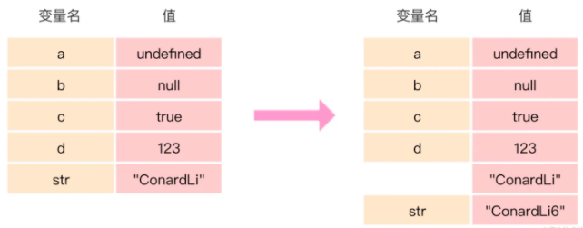
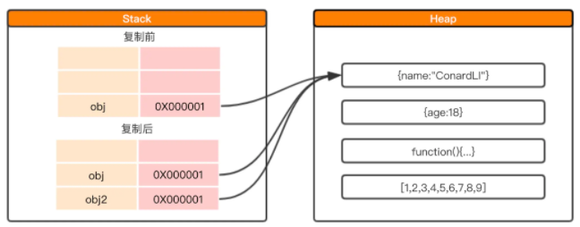
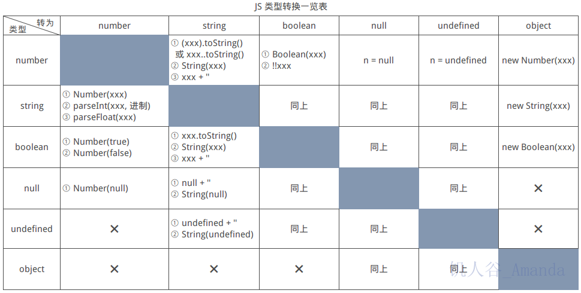
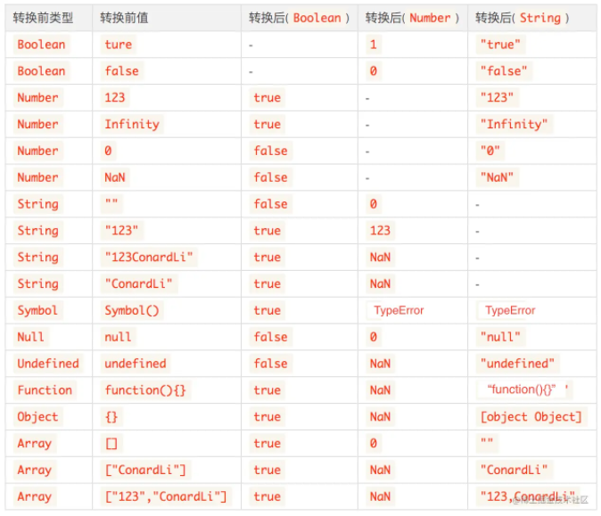

## **类型**
JavaScript 是一种弱类型或者说动态语言。这意味着你不用提前声明变量的类型，在程序运行过程中，类型会被自动确定。这也意味着你可以使用同一个变量保存不同类型的数据。
- Undefined `typeof instance === 'undefined'`
- Null `typeof instance === 'object'`
- Number `typeof instance === 'number'`
- String `typeof instance === 'string'`
- Boolean `typeof instance === 'boolean'`
- Symbol `typeof instance === 'symbol'`
- BigInt `typeof instance === 'bigint'`
- Object：`typeof instance === 'object'` 基于Object还实现了其他常用对象子类，如Array,Function,Date,Error,RegExp 
（任何 constructed 对象实例的特殊非数据结构类型，也用做数据结构：new Object，new Array，new Map，new Set，new WeakMap，new WeakSet，new Date，和几乎所有通过 new keyword 创建的东西。）
::: tip
typeof 操作符的唯一目的就是检查数据类型，如果我们希望检查任何从 Object 派生出来的结构类型，使用 typeof 是不起作用的，因为总是会得到 "object"。检查 Object 种类的合适方式是使用 instanceof 关键字。但即使这样也存在误差。
:::


### **原始值**
除 Object 以外的所有类型都是不可变的（值本身无法被改变）。例如，与 C 语言不同，JavaScript 中字符串是不可变的（译注：如，JavaScript 中对字符串的操作一定返回了一个新字符串，原始字符串并没有被改变）。我们称这些类型的值为“原始值”。

**Null** `null`

**Undefined** `undefined` 一个没有被赋值的变量会有个默认值 undefined

**Boolean** `true` `false`

**Number** `+Infinity` `-Infinity` `NaN` 
基于 IEEE 754 标准的双精度 64 位二进制格式的值（-(2^53 -1) 到 2^53 -1）
`Number.MAX_SAFE_INTEGER`常量来表示最大安全整数，`Number.MIN_SAFE_INTEGER`常量表示最小安全整数

**BigInt** 
BigInt 类型是 JavaScript 中的一个基础的数值类型，可以表示任意精度的整数。使用 BigInt，您可以安全地存储和操作大整数，甚至可以超过数字类型的安全整数限制。
JS 中的Number类型只能安全地表示-9007199254740991 (-(2^53-1)) 和9007199254740991(2^53-1)之间的整数，任何超出此范围的整数值都可能失去精度。
BigInt也可以用二进制、八进制或十六进制表示
1. 创建BigInt
- 在数字末尾追加n `9007199254740995n`
- 调用BigInt()构造函数 `BigInt("9007199254740995")`
2. 与数字比较
- `10n === 10 // false (类型不同)`
- `10n == 10 // true`
3. 除一元加号(+)运算符外，所有算术运算符都可用于BigInt(不支持一元加号（+）运算符的原因是某些程序可能依赖于+始终生成Number的不变量，或者抛出异常。 更改+的行为也会破坏asm.js代码。)
`+10n; // → TypeError: Cannot convert a BigInt value to a number`
4. 因为隐式类型转换可能丢失信息，所以不允许在bigint和 Number 之间进行混合算术操作（转换不精确）。 
`10 + 10n //TypeError: Cannot mix BigInt and other types, use explicit conversions`

**String**
1. 不可更改


 #### 存储空间
在JavaScript中，每一个变量在内存中都需要一个空间来存储。
内存空间又被分为两种：
- 栈内存
- 堆内存
### 栈内存
- 存储的值大小固定
- 空间较小
- 可以直接操作其保存的变量，运行效率高
- 由系统自动分配存储空间
JavaScript中的原始类型的值被直接存储在栈中，在变量定义时，栈就为其分配好了内存空间。
由于栈中的内存空间的大小是固定的，那么注定了存储在栈中的变量就是**不可变**的。
```js
let str = 'str'
str += '6'
console.log(str);  // str6
```




```js
var name = 'str';
var name2 = name;
name2 = 'code';
console.log(name); // str;
```
内存中有一个变量name，值为str。我们从变量name复制出一个变量name2，此时在内存中创建了一个块新的空间用于存储str，虽然两者值是相同的，但是两者指向的内存空间完全不同，这两个变量参与任何操作都互不影响。

### 堆内存
- 存储的值大小不定，可动态调整
- 空间较大，运行效率低
- 无法直接操作其内部存储，使用引用地址读取
- 通过代码进行分配空间
引用类型的值实际存储在堆内存中，它在栈中只存储了一个固定长度的地址，这个地址指向堆内存中的值。



```js
var obj = {name:'str'};
var obj2 = obj;
obj2.name = 'code';
console.log(obj.name); // code
```
当我们复制引用类型的变量时，实际上复制的是栈中存储的地址，所以复制出来的obj2实际上和obj指向的堆中同一个对象。因此，我们改变其中任何一个变量的值，另一个变量都会受到影响，这就是为什么会有深拷贝和浅拷贝的原因。


## 值传递与引用传递
ECMAScript中所有的函数的参数都是按值传递的

## null和undefined
**null**
- 表示被赋值过的对象，刻意把一个对象赋值为null，故意表示其为空，不应有值。
- 所以对象的某个属性值为null是正常的，null转换为数值时值为0。
**undefined** 
- 表示“缺少值”，即此处应有一个值，但还没有定义。
- 如果一个对象的某个属性值为undefined，这是不正常的，如obj.name=undefined，我们不应该这样写，应该直接delete obj.name。
- undefined转为数值时为NaN(非数字值的特殊值)。
**JavaScript是一门动态类型语言，成员除了表示存在的空值外，还有可能根本就不存在（因为存不存在只在运行期才知道），这就是undefined的意义所在。对于JAVA这种强类型语言，如果有"undefined"这种情况，就会直接编译失败，所以它不需要一个这样的类型。**

## Symbol
### Symbol特性
1. 根据规范，对象的属性键只能是**字符串类型**或者 **Symbol 类型**。
2. 一个symbol值能作为对象属性的标识符,**这是该数据类型仅有的目的**。
3. 每个从Symbol()返回的symbol值都是**唯一**的。
可选用一个字符串用于描述,描述只是一个标签，不影响任何东西，可以方便调试。
```js
// id1、id2 是描述
let id1 = Symbol("id")
let id2 = Symbol("id")
id1 === id2 // false
```
当参数为对象时，将调用对象的toString()方法。
```js
let sym = Symbol({name:'str'}); // Symbol([object Object])
```
如果我们想创造两个相等的Symbol变量，可以使用`Symbol.for(key)`。
使用给定的key搜索现有的symbol，如果找到则返回该symbol。否则将使用给定的key在全局symbol注册表中创建一个新的symbol。
```js
let sym1 = Symbol.for('str');
let sym2 = Symbol.for('str');
console.log(sym1 === sym2); // true

// Symbol.keyFor(sym)，通过全局 Symbol 返回一个名字。如果不是全局的将搜索不到。
alert( Symbol.keyFor(sym1) ); // str 
```
4. new 操作符会报错
这会阻止创建一个显式的 Symbol 包装器对象而不是一个 Symbol 值。
围绕原始数据类型创建一个显式包装器对象从 ECMAScript 6 开始不再被支持。 然而，现有的原始包装器对象，如 new Boolean、new String以及new Number，因为遗留原因仍可被创建。
```js
var sym = new Symbol(); // TypeError
```
5. 可以使用typeof运算符判断一个Symbol类型
```js
typeof Symbol() === 'symbol'
```
6. Symbol不会被隐式地转为字符串
JavaScript 中的大多数值都支持字符串的隐式转换。例如，alert 一个Symbol 的时候会报错。
这是一种防止混乱的“语言保护”，因为字符串和 Symbol 有本质上的不同，不应该意外地将它们转换成另一个。
如果想显示Symbol,可以调用Symbol的toString方法，或者获取描述属性(可以显示描述)。
```js
let id = Symbol("id")
alert(id.toString()) // Symbol(id)
alert(id.description) // id
```
7. **不可枚举性**
当使用Symbol作为对象属性时，可以保证对象不会出现重名属性，调用for...in不能将其枚举出来，另外调用Object.getOwnPropertyNames、Object.keys()也不能获取Symbol属性。
`Object.getOwnPropertySymbols()` 方法用于专门获取Symbol属性。
它让你在查找一个给定对象的符号属性时返回一个symbol类型的数组。注意，每个初始化的对象都是没有自己的symbol属性的，因此这个数组可能为空，除非你已经在对象上设置了symbol属性。
```js
// 如果我们要在对象字面量 {...} 中使用 Symbol，则需要使用方括号把它括起来。
let ex = {[Symbol('ex')]: 'example'}

let sym = Symbol('name2')
let obj = {
  name:'str',
  age: 12,
  [sym]:'name' // 使用描述符也需要[]
}
// Object.getOwnPropertyNames会忽略Symbol
Object.getOwnPropertyNames(obj); // ["name", "age"]
// Ojbect.keys会忽略Symbol
Object.keys(obj); // ["name", "age"]
// for in 会忽略Symbol
for (let i in obj) {
   console.log(i); // name age
}
// Object.getOwnPropertySymbols仅获取Symbol
Object.getOwnPropertySymbols(obj) // [Symbol(name2)]
// Object.assign会复制Symbol
let clone = Object.assign({}, obj);
alert( clone[sym] ); // 'name'
```
8. 系统Symbol
JavaScript 内部有很多(“系统” Symbol)[https://tc39.es/ecma262/#sec-well-known-symbols]

### Symbol应用场景
1. 防止XSS 
如果你的服务器有一个漏洞，允许用户存储任意JSON对象， 而客户端代码需要一个字符串，这可能会成为一个问题：
```js
// JSON
let expectedTextButGotJSON = {
  type: 'div',
  props: {
    dangerouslySetInnerHTML: {
      __html: '/* put your exploit here */'
    },
  },
};
let message = { text: expectedTextButGotJSON };
<p>
  {message.text}
</p>
```
JSON中不能存储Symbol类型的变量，这就是防止XSS的一种手段。
[React中是如何通过$$typeof防止XSS攻击的](https://juejin.cn/post/6844904137348349960)
2. **模拟私有属性**
借助Symbol类型的不可枚举，我们可以在类中模拟私有属性，控制变量读写
```js
const privateField = Symbol();
class myClass {
  constructor(){
    this[privateField] = 'str';
  }
  getField(){
    return this[privateField];
  }
  setField(val){
    this[privateField] = val;
  }
}
```
3. **防止属性污染**
在某些情况下，我们可能要为对象添加一个属性，此时就有可能造成属性覆盖，用Symbol作为对象属性可以保证永远不会出现同名属性。
```js
Function.prototype.myCall = function (context) {
  if (typeof this !== 'function') {
    return undefined; // 用于防止 Function.prototype.myCall() 直接调用
  }
  context = context || window;
  const fn = Symbol();
  context[fn] = this;
  const args = [...arguments].slice(1);
  const result = context[fn](...args);
  delete context[fn];
  return result;
}
```
4. **防止库之间的命名冲突**

## Number
**精度丢失** 计算机中所有的数据都是以二进制存储的，所以在计算时计算机要把数据先转换成二进制进行计算，然后在把计算结果转换成十进制。
`0.1+0.2!=0.3`的原因：在计算0.1+0.2时，二进制计算发生了精度丢失，导致再转换成十进制后和预计的结果不符。
[0.1 + 0.2 != 0.3](https://0.30000000000000004.com/)
**js对二进制小数的存储方式** ECMAScript中的Number类型遵循IEEE 754标准。使用64位固定长度来表示。事实上有很多语言的数字类型都遵循这个标准，例如JAVA,所以很多语言同样有着上面同样的问题。
JavaScript使用的是64位双精度浮点数编码，所以它的符号位占1位，指数位占11位，尾数位占52位。通常看到的二进制，其实是计算机实际存储的尾数位。尾数位只能存储52个数字，由于限制，有效数字第53位及以后的数字是不能存储的，它遵循，如果是1就向前一位进1，如果是0就舍弃的原则。

**推荐计算库**
[mathjs](https://github.com/josdejong/mathjs/)
[number-precision](https://github.com/nefe/number-precision)

**JavaScript能表示的最大数字**`Number.MAX_VALUE`
**最大安全数字**`Number.MAX_SAFE_INTEGER`即在这个数范围内不会出现精度丢失（小数除外）,另外bigInt类型在es10中被提出，使用bigInt可以操作超过最大安全数字的数字。

## 其他引用类型
- Array
- Date
- RegExp
- Function
- Math
- Error 
- ...
### 包装类型
为了便于操作基本类型值，ECMAScript还提供了几个特殊的引用类型，他们是基本类型的包装类型：
- Boolean
- Number
- String
```js
true === new Boolean(true); // false
123 === new Number(123); // false
'str' === new String('str'); // false
console.log(typeof new String('str')); // object
console.log(typeof 'str'); // string
```
> **引用类型和包装类型的主要区别**就是对象的生存期，使用new操作符创建的引用类型的实例，在执行流离开当前作用域之前都一直保存在内存中，而基本类型则只存在于一行代码的执行瞬间，然后立即被销毁，这意味着我们不能在运行时为基本类型添加属性和方法。
```js
var name = 'str'
name.color = 'red';
console.log(name.color); // undefined
```
### 装箱和拆箱
- 装箱转换：把基本类型转换为对应的包装类型
- 拆箱操作：把引用类型转换为基本类型
**原始类型调用方法**:
每当我们操作一个基础类型时，后台就会自动创建一个包装类型的对象，从而让我们能够调用一些方法和属性。
即使用基本类型调用方法，就会自动进行装箱和拆箱操作。
```js
// 1. 创建一个String的包装类型实例
// 2. 在实例上调用substring方法
// 3. 销毁实例
var name = "str";
var name2 = name.substring(2);
```
**拆箱过程**
会遵循ECMAScript规范规定的`toPrimitive`原则，一般会调用引用类型的`valueOf`和`toString`方法,也可以直接重写toPeimitive方法。
一般转换成不同类型的值遵循的原则不同，例如：
- 引用类型转换为Number类型，先调用valueOf，再调用toString
- 引用类型转换为String类型，先调用toString，再调用valueOf
若valueOf和toString都不存在，或者没有返回基本类型，则抛出TypeError异常。
```js
const obj = {
  valueOf: () => { console.log('valueOf'); return 123; },
  toString: () => { console.log('toString'); return 'str'; },
};
console.log(obj - 1);   // valueOf   122
console.log(`${obj}str`); // toString  strstr

const obj2 = {
  [Symbol.toPrimitive]: () => { console.log('toPrimitive'); return 234; },
};
console.log(obj2 - 1);   // valueOf   233

const obj3 = {
  valueOf: () => { console.log('valueOf'); return {}; },
  toString: () => { console.log('toString'); return {}; },
};
console.log(obj3 - 1);  
// valueOf  
// toString
// TypeError
```
## 类型转换
### 强制类型转换
- 转为Number `Number()` / `parseInt()` / `parseFlota`
- 转为String `String()` / `toString()`
- 转为Boolean `Boolean()`
- 转为引用类型 `new Boolean()`/`new String()`/`new Number()`

### 隐式转换
**推荐使用===来判断两个值是否相等!**

1. **if语句和逻辑语句**
会转为false的几种情况：
- null
- undefined
- 0 
- ""
- NaN
- false
2. **数学运算符**
对各种非Number类型运用数学运算符(- * /)时，会先将非Number类型转换为Number类型
如：true => 1 , null => 0 , undefined => NaN, ["1"] => 1
`注` + 是例外
- 当一侧为String类型，被识别为字符串拼接，并会**优先**将另一侧转换为字符串类型。
- 当一侧为Number类型，另一侧为原始类型，则将原始类型转换为Number类型。
- 当一侧为Number类型，另一侧为引用类型，将引用类型和Number类型转换成字符串后拼接。
3. **==**
使用==时，若两侧类型相同，则比较结果和===相同，否则会发生隐式转换，使用==时发生的转换可以分为几种不同的情况（只考虑两侧类型不同）：
  1. **NaN** : NaN和其他任何类型比较永远返回false(包括和他自己)。
    ```js
    NaN == NaN // false
    ```
  2. **Boolean** : Boolean和其他任何类型比较，Boolean首先被转换为Number类型。
    > 这里注意一个可能会弄混的点：undefined、null和Boolean比较，虽然undefined、null和false都很容易被想象成假值，但是他们比较结果是false，原因是false首先被转换成0：
    ```js
    undefinde == false // false
    null == false // false
    ```
  3. **String和Number** ：String和Number比较，先将String转换为Number类型。
  4. **null和undefined** : null == undefined比较结果是true，除此之外，null、undefined和其他任何结果的比较值都为false。
  5. **原始类型和引用类型** : 当原始类型和引用类型做比较时，对象类型会依照ToPrimitive规则转换为原始类型
    ```js
    // 1.!的优先级高于==，![]首先会被转换为false
    // 2.false会转为0
    // 3.左侧[]会转为0
    [] == ![] // true
    ```
### 一道面试题
如何让`a == 1 && a == 2 && a == 3`?
```js
const a = {
  value: [3, 2, 1],
  valueOf: function(){
    return this.value.pop()
  }
}
```

## toString 最精准的类型判断
**用来进行引用类型的判断或转换**
Object类型的每个实例都有toString()方法，返回对象的字符串表示，所以每个实例化的对象都可以调用toString()方法。
如果此方法在自定义对象中未被覆盖，**toString() 返回 "[object type]"，其中 type 是对象的类型**。
事实上，其他类型都或多或少重写了toString()方法，导致不同类型的对象调用toString()方法产生返回值各不相同。可以直接调用Object原型上未被覆盖的toString()方法，使用call来改变this指向来达到我们想要的效果。

### 如何直接使用Object.prototype.toString
```js
//不通过原型链查找,正确直接使用方式
Object.prototype.toString.call/apply(obj)  //'[object Object]'

//虽然输出一样，但这是因为Object.prototype也是对象
Object.prototype.toString() //'[object Object]'
```
数组对象通过this绑定调用Array.prototype.toString()方法，返回数组值的字符串拼接，但是非数组对象通过this绑定调用Array.prototype.toString()方法，返回的是该对象的字符串表示，另外null和undefined不可以通过绑定调用Array.prototype.toString()方法。
```js
var array = [1, 's', true, {a: 2}];
array.toString();//"1,s,true,[object Object]"
Array.prototype.toString.call(array);//"1,s,true,[object Object]"

Array.prototype.toString.call({});   //"[object Object]"
Array.prototype.toString.call(1)   //"[object Number]"
```
除了Object和Array两种情况，其他类型都不支持非自身实例通过this绑定调用该Object子类原型对象上的toString()方法，这说明它们在重写toString()方法时，明确限定了调用该方法的对象类型，非自身对象实例不可调用。所以，一般我们只使用Object.prototype.toString.call/apply()方法。

### 类型检查
```js
Object.prototype.toString.call({});   //"[object Object]"
Object.prototype.toString.call([]);   //"[object Array]"
Object.prototype.toString.call(function(){});   //"[object Function]"
Object.prototype.toString.call('');   //"[object String]"
Object.prototype.toString.call(1);   //"[object Number]"
Object.prototype.toString.call(true);   //"[object Boolean]"
Object.prototype.toString.call(null);   //"[object Null]"
Object.prototype.toString.call(undefined);  //"[object Undefined]"
Object.prototype.toString.call();  //"[object Undefined]"
Object.prototype.toString.call(new Date());  //"[object Date]"
Object.prototype.toString.call(/at/);   //"[object RegExp]"
(function(){
    Object.prototype.toString.call(arguments);  //[object Arguments]
})()
Object.prototype.toString.call(document);  //[object HTMLDocument]
```
### 其他对象重写
- **null和undefined**
没有相应的构造函数，所以它们没有也无法调用toString()方法，也就是说它们不能访问任何属性和方法，只是基本类型而已。

- **基本包装类型（Boolean/Number/String类）**
**为什么基本类型也可以调用toString呢？**
由于String基本包装类型的存在，在必要的时候JS引擎会把字符串字面量转换成一个String对象，从而可以执行访问属性和方法的操作
（1）创建一个String类型的实例；
（2）在实例上调用指定的方法；
（3）销毁这个实例。
```js
var strObject = new String('wangpf');
strObject.toString(); //'wangpf'
strObject = null;
```
`注意`：上述代码是JS引擎自动执行的，你无法访问strObject对象，它只存在于代码的执行瞬间，然后立即销毁，所以我们无法再运行时给基本类型添加属性和方法，除非直接通过new显示调用基本包装类型创建对象，但是不建议

string VS stringObject
```js
var str = 'I am a string';
typeof str; //"string"
str instanceof String; //false

var strObject = new String('I am a string');
typeof strObject; //"object"
strObject instanceof String; //true
strObject instanceof Object; //true
```
**什么时候会触发自动调用呢？**
使用操作符的时候，如果其中一边为对象，则会先调用toSting方法，也就是隐式转换，然后再进行操作。

- **其他**
```js
// String
var str = "a";
str.toString(); //"a"
String.prototype.toString.call(str); //"a"

// Number
var num = 520;
num.toString(); //"520"
Number.prototype.toString.call(num); //"520"

// Boolean
var boo = true;
boo.toString(); //"true"
Boolean.prototype.toString.call(boo); //"true"

// Date
var date = new Date();
date.toString();
//"Fri May 11 2018 14:55:43 GMT+0800 (中国标准时间)"
Date.prototype.toString.call(date);
//"Fri May 11 2018 14:55:43 GMT+0800 (中国标准时间)"

// RegExp
var re = /cat/g;
re.toString();// "/cat/g"
RegExp.prototype.toString.call(re);// "/cat/g"

// 另外：直接调用toString()应该就是变相的undefined.toString()方法
Object.prototype.toString.call();  //"[object Undefined]"
```
用toString.call/apply(this)去代替Object.prototype.toString.call/apply(this)使用，是不严谨的，容易导致一些问题，比如当我们自定义了toString()方法时，直接调用toString()方法，就不会再默认调用Object类的toString()方法，而是会使用我们自定义的方法，这样可能得不到我们想要的结果，所以我们还是应当尽量使用Object.prototype.toString.call/apply(this)。


## typeof 
### 使用场景
typeof操作符可以**准确判断**一个变量是否为下面几个原始类型：
```js
typeof 'str' // string
typeof 1 // number
typeof true // boolean
typeof Symbol() // symbol
typeof undefined // undefined
typeof function(){} // function
```
### 不适用场景
1. 除函数外所有的引用类型都会被判定为object。
```js
typeof [] // object
typeof {} // object
typeof new Date() // object
```
2. `typeof null === 'object'`

### 总结
所以在用 typeof 来判断变量类型的时候，我们需要注意，最好是用 typeof 来判断基本数据类型（包括symbol），避免对 null 的判断。因为 typeof null 结果为 "object"。
```js
typeof 1 === 'number' // true
typeof Infinity === 'number'; // true
typeof NaN === 'number'; // true, 尽管它是 "Not-A-Number" (非数值) 的缩写

typeof '123' === 'string' // true
typeof (typeof 1) === 'string'; // typeof 总是返回一个字符串
typeof String(1) === 'string'; // String 将任意值转换为字符串，比 toString 更安全

typeof null === 'object' // true，注意 null 不是对象，这里是特殊的。

typeof [1, 2, 4] === 'object'; // true

typeof true === 'boolean' // true
typeof function a() {} === 'function'
typeof Symbol(2) === 'symbol'
typeof undefined === 'undefined'

// 使用new操作符
// 除 Function 外的所有构造函数的类型都是 'object'
typeof new Number(100) === 'object'
typeof new String('123') === 'object'
typeof new Date() === 'object'
var func = new Function();
typeof func === 'function'

//NaN
typeof Number("123z") === "number" // 123z 在转数字的是时候遇到z出错就是NaN了。NaN为number类型
typeof 1/0; //NaN（这个NaN不是字符串类型，是数值类型）
typeof (typeof 1/0) === 'number'; //NaN（这个NaN不是字符串类型，是数值类型）
```

## instanceof
**instanceof 只能用来判断引用数据类型，基本数据类型不可以。**
```js
[] instanceof Array // true
new Date() instanceof Date // true
new RegExp() instanceof RegExp // true
```
**缺点**
1. 原型链指向改动的话，这个的判断就可能会出错。
我们先来回顾下原型链的几条规则：
  - 所有引用类型都具有对象特性，即可以自由扩展属性
  - 所有引用类型都具有一个__proto__（隐式原型）属性，是一个普通对象
  - 所有的函数都具有prototype（显式原型）属性，也是一个普通对象
  - 所有引用类型__proto__值指向它构造函数的prototype
  - 当试图得到一个对象的属性时，如果变量本身没有这个属性，则会去他的__proto__中去找
[] instanceof Array实际上是判断Array.prototype是否在[]的原型链上。
所以，使用instanceof来检测数据类型，不会很准确，这不是它设计的初衷。
2. 在存在多个全局作用域的情况下无法得到准确的结果。
eg: var isArray = value instanceof Array;
返回TRUE的前提是 value是一个数组，并且该变量要和Array构造函数在同一个全局作用域中；不然若是value在其他的frame框架中定义的数组，上述代码就会返回false。
检测对象是原生对象还是开发人员自定义对象时也会有不可靠情况发生。

## 作用域安全的构造函数
Object.prototype.toString方法不能检测非原生构造函数的构造函数名。所以如果用它检测自定义的构造函数会返回[object Object]
```js
function Person(name, age) {
    console.log('this', this)
    this.name = name
    this.age = age
}

let p1 = new Person('p1',11)
let p2 = Person('p2',12)  //相当于函数调用，此时构造函数Person内的this会指向window

// 解决办法：用instanceof创建一个作用域安全的构造函数
function Person(name, age) {
    if (this instanceof Person) {
        this.name = name
        this.age = age
    } else {
        return new Person(name, age)
    }
}
``` 

[由Object.prototype.toString.call( )引发关于toString( )方法的思考](https://juejin.cn/post/6844903604990509063)
[typeof、instanceof、Object.prototype.toString](https://juejin.cn/post/6949005060705779720#heading-0)
[浅谈 instanceof 和 typeof 的实现原理](https://juejin.cn/post/6844903613584654344)
[判断是否是数字](https://zhuanlan.zhihu.com/p/267990898)
[你真的掌握变量和类型了吗](https://juejin.cn/post/6844903854882947080#heading-8)
[JS最新基本数据类型：BigInt](https://juejin.cn/post/6844903902295359502)