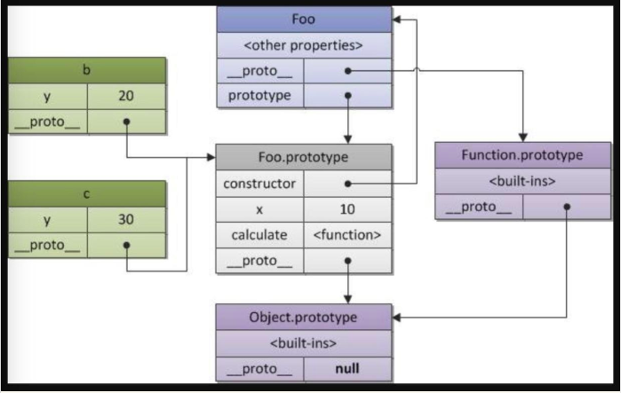

# 原型/原型链/class/原型模式
## 原型模式
原型模式不仅是一种设计模式，它还是一种编程范式（programming paradigm），是 JavaScript 面向对象系统实现的根基。
借助Prototype来实现对象的创建和原型的继承，那么我们就是在应用原型模式。

## 原型与原型链
**原型链**：最开始发明的原因是为了节省内存, __ proto __指向一个原型，通过逐级向上查找直至 Object 的原型为止（是原型链查询中实际用到的，它总是指向 prototype）。
**原型**：prototype （在定义构造函数时自动创建，它总是被 __proto__ 所指）
**注意**：开发时不要直接用__proto__这个属性，性能十分低
```js
var obj1 = {name:'YY'}
var obj2 = {'age':18}
console.dir(obj1)  //打印所有属性及属性值
//name:"YY"
//__proto__:（存储一个地址，指向它(继承)的(原型prototype)共有属性）
//  constructor:
//  toString:(常用)
//  valueOf:(常用)
//  ...
​
obj1.__proto__ === obj2.__proto__  //ture
//注意：开发时不要直接用__proto__这个属性，性能十分低
```
总结：
- prototype是函数的原型对象，即 **prototype是一个对象**，它会被对应的 __ proto __引用。
- 要知道自己的 __ proto __引用了哪个 prototype，只需要看看是哪个构造函数构造了它，那它的 __ proto __就是那个构造函数的 prototype。
- (理解成为第一句和第二句话的一个例外)
所有的构造函数的原型链最后都会引用 Object构造函数的原型，即可以理解 Object构造函数的原型是所有原型链的最底层，即 
```js
Object.prototype.__ proto __=== null
```
```js
function Foo (y){
    this.y = y
}
var b = new Foo(20)
​
b.__proto__ === Foo.prototype
Foo.__proto__ === Function.prototype
Function.__proto__ === Function.prototype
Array.__proto__ === Function.prototype
Function.prototype.__proto__ === Object.prototype
Object.prototype.__proto__ === null
```



## 类
```js
//无原型链，每个实例的共有属性都会消耗一份内存
var dogs = []
var dog
for(var i=0;i<100;i++){
    dog = {
        sound: '汪汪汪',
        species: 'dog',
        jump: function(){},
    }
    dogs.push(dog)
}
​
//原型链
var dogsCommon = {  
    species: 'dog',
    jump: function(){}
}
var dogs = []
var dog
for(var i=0;i<100;i++){
    dog = {
        hair = "black",
    }
    dog.__proto__ = dogsCommon
    dogs.push(dog)
}


//构造函数
var dogsCommon = {   
    species: 'dog',
    jump: function(){}
}
function creatDog(){
    var obj = {
        hair = "black",
    }
    obj.__proto__ = dogsCommon
    return obj
}
var dogs = []
for(var i=0;i<100;i++){
    dogs.push(creatDog())
}
```

### 改进
```js
//createDog.dogsCommon = { 
createDog.prototype = {  //共有属性有个名字叫原型prototype
    //从名字上建立dogsCommon与createDog的关系
    //函数createDog是对象！
    //createDog函数声明提升，可以对createDog进行操作
    species: 'dog',
    jump: function(){}
}
function createDog(){  
    var obj = {
        hair = "black",
    }
    // obj.__proto__ = createDog.dogsCommon 
    obj.__proto__ = createDog.prototype //内容在执行时才会生效，即使createDog写在前面，也能调用createDog.prototype
    return obj
}
var dogs = []
for(var i=0;i<100;i++){
    //dogs.push(createDog())
    Array.prototype.push.call(
        dogs,createDog.call()
    )
}
```
## new
满足批量创建对象的需求
new 帮忙将上面的代码帮忙写好
(1)js已经帮忙初始化一个空对象this，不需要自己去想变量名
(2)帮忙创建好obj. __proto__ = createDog.prototype, 同时会为其自动创建constructor属性，表述了所有的实例都是由createDog创建的。
(3)已经帮忙返回this，不需要自己去写。如果自己写了return,如return {}，最后就会返回一个{}，this没有返回，如果return 1,js认为构造函数应该返回对象，所以会忽略这句话
注意：不要对createDog.prototype重新赋值，会使得prototype指向另一个没有constructor的对象
```js
function Dog(hair){  
    // var obj = {
    //    hair = "black",
    // }
    // obj.__proto__ = createDog.prototype 
    // return obj
    this.hair = hair || 'black'
}
//createDog.prototype = {  
//    constructor: createDog  
      // js默认设置该属性
      // 不要对createDog.prototype重新赋值，会使得prototype指向另一个没有constructor的对象
//}
Dog.prototype.species = 'dog'
Dog.prototype.jump = function(){}
```

约定俗成的一些事：
1. 构造函数首字母大写 CreatSoldier
2. 构造函数省略creat 因为new已经代表了creat的意思
3. 如果构造函数没有参数，可以省略括号
```js
//模拟实现new操作符
function myNew(constructor){
    //ES6 new.target 返回new命令作用于的那个构造函数。
    //如果构造函数不是通过new命令或Reflect.construct()调用的，new.target会返回undefined
    //因此这个属性可以用来确定构造函数是怎么调用的。
    myNew.target = constructor
    
    let newObject = Object.create(constructor.prototype)
    
    //除去构造函数的其余参数
    //var argsArr = [...args]   //myNew(constructor,...args)
    //var argsArr = Array.from(arguments).slice(1)
    //var argsArr = [].slice.call(arguments,1)
    let argsArr = Array.prototype.slice.call(arguments,1)   
    let constructorReturn = constructor.apply(newObject,argsArr)  //绑定this
    if((typeof constructorReturn === 'object' && constructorReturn!==null) 
       || typeof constructorReturn==='function'){
        return constructorReturn
    }
    
    //如果构造函数没有返回对象类型`Object`(包含`Functoin`, `Array`, `Date`, `RegExg`, `Error`)，那么`new`表达式中的函数调用会自动返回这个新的对象。
    return newObject  
}

//使用 instance = myNew(constructor,options)
```

## 继承
```js
//JS模拟继承
function Dogs(options){
    this.species = options.species
    this.sound = options.sound
}
Dogs.prototype.jump = function(){}
Dogs.prototype.eat = function(){}
​
//继承
function Corgi(options){
    //特有属性继承
    Dogs.call(this,options)
    this.leg = "short"
}
Corgi.prototype.wagTail = function(){}
​
//公有属性继承
Corgi.prototype.__proto__ = Dogs.prototype
​
//实例化
var laifu = new Corgi({species'Corgi',sound:'汪汪汪'})
```
### 改进
__proto__不推荐使用，但是可以用new,
即不要这样：Corgi.prototype.__proto__ = Dogs.prototype
```js
//new做的事
function ins(){
    this = {}
    this.__proto__ = father.prototype
    return this
}
//继续改写
function Dogs(){
    this = {} //这个空对象最后只有一个属性__proto__
    this.__proto__ = father.prototype
    // Corgi.prototype.__proto__ = Dogs.prototype
    return this
}
​
Corgi.prototype = new Dogs()
//推断
Corgi.prototype.__proto__ === this.__proto__ === Dogs.prototype
​
//但是此时有两个问题，1.Dogs已经定义；2.Dogs内部有this
//模拟空函数,保留Dogs的共有属性，不保留特有属性
function fakeDogs(){}
fakeDogs.prototype = Dogs.prototype
Corgi.prototype = new fakeDogs()
```
### 整理
```js
function Dogs(options){
    this.species = options.species;
    this.sound = options.sound;
}
Dogs.prototype.eat = function(){}
Dogs.prototype.jump = function(){}
​
//继承
function Corgi(options){
    //特有属性继承
    Dogs.call(this,options)
    //Corgi特有属性
    this.character = options.character
}
​
//相当于 Corgi.prototype.__proto__ = Dogs.prototype
//公有属性继承(三行代码)，写在自己的公有属性前面，避免覆盖
​
//ES3 兼容IE
function fakeDogs(){}
fakeDogs.prototype = Dogs.prototype
Corgi.prototype = new fakeDogs()
//ES5 不兼容IE
Corgi.prototype = Object.create(Dogs.prototype)
​
//Corgi公有属性
Corgi.prototype.wagTail = function(){}
Corgi.prototype.legs = 'short'
​
var laifu = new Corgi({species:'Corgi',sound:'汪汪汪',character:'活泼'})
```
## ES6：Class
```js
class Dogs{
    //构造函数写在constructor里
    constructor(options){
        this.species = options.species
        this.hair = options.hair
    }
    eat(){}
    jump(){}
}
// extends  相当于 Corgi.prototpye = Object.create(Dogs.prototype)
// 但是公有属性不支持非函数的了
class Corgi extends Dogs{
    constructor(options){
        //有父类去构造，继承特有属性，写在自己的特有属性之前，子元素有构造函数的话必须写
        super(options)
        this.legs = "short"
        this.character = options.character
    }
    wagTail(){}
}
```

关于java相关知识的一些补充，帮助理解：
Java/C++ 的特性是什么？它们是强类型的静态语言。
三大特点（但并不是面向对象独有）
封装：隐藏细节，对外方便合作（API），对内减轻思维负担（同一功能只写一次）（函数也能起到封装作用）
继承：可以复用代码。【js中ES6之前用原型链实现共有属性继承】
多态：让代码更灵活。（拥有多重身份，属性特点，如div.childNodes 节点 div.children 元素节点）（js是动态语言，其实就是多态的）
（补充说明：同一个操作作用于不同的对象上，可以产生不同的解释和不同的执行结果）
多态最常见的2种实现方式：
- 覆盖
- 重载
覆盖指子类重新定义父类方法，这正好就是基于prototype继承的。
重载是指多个同名但参数不同的方法，这个JavaScript确实没有。）

java中的class：
class/abstract/interface
java中的类设计更完整：private/default/protect/public + 类型(如Long/Int等)
javascript中要实现这些概念需要去模仿，但是底层原理是一样的，如共有方法也都是存储在同一块地址上，避免造成空间的浪费
```js
function Create(){
  privateFunction()
}
Create.prototype.protectFunction = function(){}

class Create{
  static privateFunction()
  protectFunction(){}
}

Create.privateFunction()
createInstance.protectFuntion()
```

java中的Abstract和Interface（类似于factoryPattern.md中栗子中的抽象类）：
共同点
A.两者都是抽象类，都不能实例化
B.Interface实现类和abstract继承类都必须实现抽象方法
不同点
A.Interface需要实现,用implements;Abstract 需要继承,用exends
B.一个类可以实现多个Interface ;一个类只能继承一个Abstract
C.Interface强调功能的实现；Abstract强调从属关系
D.Interface的所有抽象类都只有声明没有方法体；Abstract抽象方法可以选择实现，也可以选择继续声明为抽象方法，无需实现，留给子类去实现
interface的应用场合
A. 类与类之间需要特定的接口进行协调，而不在乎其如何实现。

java中使用原型模式，举个栗子：
（java中原型模式的出现是为了实现类型之间的解耦？理解是new时需要注意传入数据类型，但是copy不用考虑这种问题）
连接数据库时，初始化声明可能很复杂（如用户，密码，数据库地址等等以及自己的方法）,
如果每次都要重复这个过程就很复杂，就可以事先做好一个模板，再用的时候直接拿到一个副本即可，这里面还可以设计回收池的问题，如一开始先声明很多个模板，然后自己的方法那为空，使用的时候将它们的副本放到池子里，就可以在池子里拿出来用，用过之后再释放资源。


参考文献：
1.[能否模拟实现JS的new操作符](https://juejin.im/post/5bde7c926fb9a049f66b8b52)
2.[JavaScript 原型链](https://juejin.im/entry/5883672c570c350062be16e5)


// 待细看
[（JavaScript）中的类继承（extends、重写方法、重写constructor、重写类字段、[[HomeObject]]）](https://blog.csdn.net/AnitaSun/article/details/110816920)