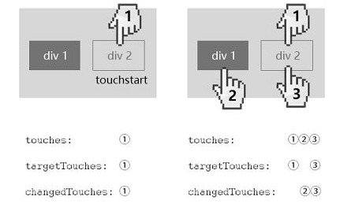

box-sizing 属性可以被用来调整这些表现:
- content-box  是默认值。content
- border-box content + border + padding

### offsetParent
HTMLElement.offsetParent 是一个只读属性，返回一个指向最近的（指包含层级上的最近）包含该元素的定位元素或者最近的 table,td,th,body元素。
- 在 Webkit 中，如果元素为隐藏的（该元素或其祖先元素的 style.display 为 "none"），或者该元素的 style.position 被设为 "fixed"，则该属性返回 null。
- 在 IE 9 中，如果该元素的 style.position 被设置为 "fixed"，则该属性返回 null。（display:none 无影响。）

### offsetTop、offsetLeft、offsetWidth 及 offsetHeight
对块级元素来说，offsetTop、offsetLeft、offsetWidth 及 offsetHeight 描述了元素相对于 offsetParent 的边界框。
clientHeight = (content height) + (padding top+padding bottom);
offsetHeight = height + padding + border.
注意：当元素设置为display:none;之后，clientHeight和offsetHeight的高度均变为0，因为浏览器不会对display:none的元素进行渲染，所以使用时一定要注意这一点.
![offset]](./images/offset.jpg)
[offsetParent、offsetLeft/offsetTop深度剖析](https://juejin.cn/post/6844903745512275981)

### jQuery offset() VS Element.getBoundingClientRect() VS js offset递归
1. 获取一个元素距离某个元素的距离
```js
function getOffset(element) {
    var elPosX = 0,
        elPosY = 0,
        tempEl = element;
    while (tempEl !== null){
        elPosX += tempEl.offsetLeft;
        elPosY += tempEl.offsetTop;
        tempEl = tempEl.offsetParent;
    }
    return { x: elPosX, y: elPosY };
}
```
2.  jQuery offset() 方法返回匹配元素相对于文档的偏移,不支持display:none元素，不计算<html> margin

3. **Element.getBoundingClientRect()**
Element.getBoundingClientRect() 方法返回元素的大小及其**相对于视口**的位置
- box-sizing: content-box 元素的尺寸等于width/height + padding + border的总和。
- box-sizing: border-box，元素的的尺寸等于 width/height。
关于距离视口位置的计算：会考虑视口区域（或其他可滚动元素）内的滚动操作，如果你需要获得相对于整个网页左上角定位的属性值，那么只要给top、left属性值加上当前的滚动位置（通过 window.scrollX 和 window.scrollY），这样就可以获取与当前的滚动位置无关的值。


`注意`:关于滚动页面
- jQuery offset() 和js原生方法基本一致，但要注意，如果页面包含滚动，但**滚动不在根元素上**，需要自己手动加上滚动距离
- Element.getBoundingClientRect() 获取的是相对于视口的问题，注意根据需要是否添加**滚动距离**。

### touchEvent
touchstart / touchmove / touchend /touchcancel(当触摸点被中断时会触发 touchcancel 事件，中断方式基于特定实现而有所不同（例如， 创建了太多的触摸点）。)

触摸点
touches：为当前屏幕上所有触摸点的列表
targetTouches：为当前对象上所有触摸点的列表
changedTouches：与上次触摸事件相比，发生改变的触摸点
- 对于 touchstart 事件, 这个 TouchList 对象列出在此次事件中新增加的触点。
- 对于 touchmove 事件，列出和上一次事件相比较，发生了变化的触点。
- 对于touchend事件，changedTouches 是已经从触摸面的离开的触点的集合（也就是说，手指已经离开了屏幕/触摸面）。


`注意` touch事件在某些触摸设备上兼容性不好（如windows大屏），可以尝试pointer（pointerup/pointermove/pointerdown）

```js
someElement.addEventListener('touchstart', function(e) {
   // Invoke the appropriate handler depending on the
   // number of touch points.
   switch (e.touches.length) {
     case 1: handle_one_touch(e); break;
     case 2: handle_two_touches(e); break;
     case 3: handle_three_touches(e); break;
     default: console.log("Not supported"); break;
   }
   console.log(e.touches[0].pageX)
 }, false);

 //jq
 someElement.on('touchstart', function(e) {
   switch (e.originalEvent.touches.length) {
     case 1: handle_one_touch(e); break;
     case 2: handle_two_touches(e); break;
     case 3: handle_three_touches(e); break;
     default: console.log("Not supported"); break;
   }
   console.log(e.originalEvent.touches[0].pageX)
 }, false);
```
1. TouchList.length
2. Touch.identifier 返回一个可以唯一地识别和触摸平面接触的点的值. 这个值在这根手指（或触摸笔等）所引发的所有事件中保持一致, 直到它离开触摸平面.  
3. Touch.pageX / Touch.pageY  触点相对于HTML文档左边沿的的X坐标. 和 clientX 属性不同, 这个值是相对于整个html文档的坐标, 和用户滚动位置无关. 因此当存在水平滚动的偏移时, 这个值包含了水平滚动的偏移.
`注意` 触点是相对于HTML文档的，**滚动是可能不在根元素上的**，而是内部元素通过overflow添加。
4. Touch.clientX / Touch.clientY 返回触点相对于可见视区(visual viewport)左边沿的的X坐标。不包括任何滚动偏移。这个值会根据用户对可见视区的缩放行为而发生变化。
5. Touch.screenX / Touch.screenY 返回触点相对于屏幕左边沿的的X坐标,不包含页面滚动的偏移量。
[Touch](https://developer.mozilla.org/zh-CN/docs/Web/API/Touch)

MouseEvent 
click /mousedown / mousemove / mouseup / mouseover / mouseout
1. clientX / clientY 参考TouchEvent
2. pageX / pageY 参考TouchEvent
3. screenX / screenY / x / y 参考TouchEvent
4. offsetX / offsetY offsetX 规定了事件对象与目标节点的内填充边（padding edge）在 X 轴方向上的偏移量。

### passtive
[关于passive event listener](https://juejin.cn/post/6844903593024159752)
### 单指移动
通过touchmove计算出两次手指的位移差，就是当前的位移量
```js
//获取移动后left,top位置
//性能更好的话可以使用transform进行移动
var getMovedPos = function(rotation, currentPageX, prePageX, currentPageY, prePageY, oldLeft, oldTop) {
    var currentX, currentY
    //如果页面发生了旋转
    switch (rotation) {
        case 0: // 普通页面移动，在touchmove中使用此情况赋值即可
            currentX = oldLeft + (currentPageX - prePageX);
            currentY = oldTop + (currentPageY - prePageY);
            break
        case 90:
            currentX = oldLeft + (currentPageY - prePageY);
            currentY = oldTop - (currentPageX - prePageX);
            break
        case -90:
            currentX = oldLeft - (currentPageY - prePageY);
            currentY = oldTop + (currentPageX - prePageX);
            break
        case 180:
            currentX = imgOldLeft - (currentPageX - prePageX);
            currentY = imgOldTop - (currentPageY - prePageY);
            break
    }
    return { x: currentX, y: currentY }
},
```

双指缩放
```js
demo.addEventListener('touchstart',function(){
  //计算以下值
  oldLeft
  oldTop
  oldWidth
  oldHeight

  //以双指中心为基准点（虚拟触摸点）
  middleX = (touch1.pageX + touch2.pageX) / 2
  middleY = (touch1.pageY + touch2.pageY) / 2
  //计算虚拟触摸点距离触摸元素的距离X,Y（touchEvent不提供offsetX,offsetY,只能自己计算）
  offsetX = middleX - demoOffsetX
  offsetY = middleY - demoOffsetY

  //斜边长
  startDistance = Math.sqrt(Math.pow((touch1X - touch2X), 2) + Math.pow((touch1Y- touch2Y), 2));
},false)


demo.addEventListener('touchmove',function(){
  //斜边长
  moveDistance = Math.sqrt(Math.pow((touch1X - touch2X), 2) + Math.pow((touch1Y- touch2Y), 2));
  scale = moveDistance/startDistance

  width = oldWidth * scale  
  height = oldHeight * scale
  //以双指中心点进行缩放，不修改transform-origin,通过计算left/top偏移进行模拟
  left = offsetX * scale - offsetX
  top = offsetY * scale - offsetY
},false)
```

transform matrix转化为键值对标识形式
```js
if (transform && transform !== 'none') {
    let values = transform.substring(7, transform.length - 1).split(',')
    var a = values[0];
    var b = values[1];
    var c = values[2];
    var d = values[3];
    var e = values[4];
    var f = values[5];
    var scale1 = Math.sqrt(a * a + b * b);
    var scale2 = Math.sqrt(c * c + d * d);
    var angle = Math.atan2(b, a) * (180.0 / Math.PI);
    e = parseFloat(e);
    f = parseFloat(f);

    return {
        scaleX: scale1,
        scaleY: scale2,
        angle: angle,
        x: e,
        y: f,
    }
}
```

TODO  双指缩放原理图待添加，旋转